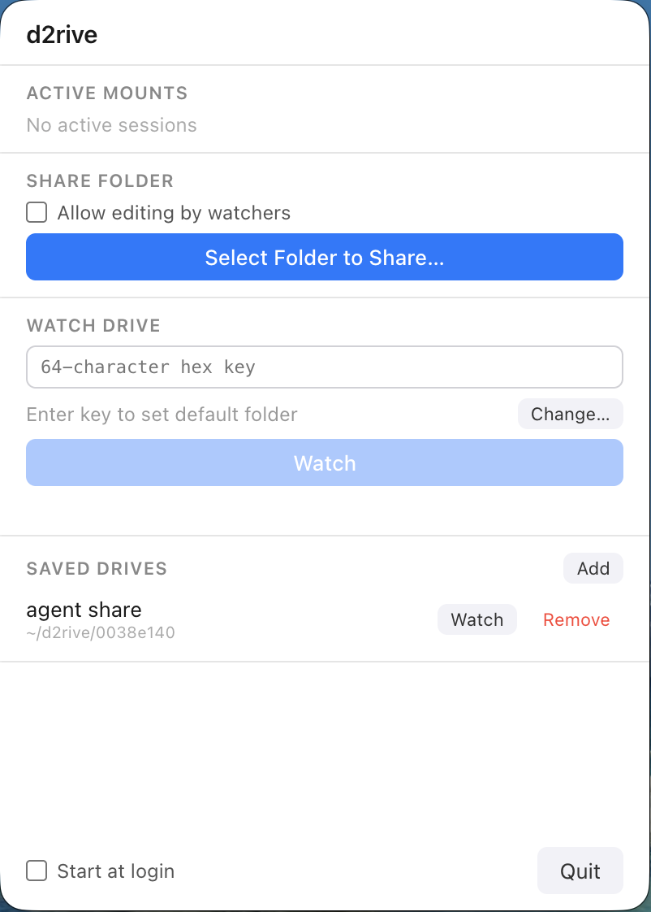

# d2rive

P2P folder sync over [Autobase](https://github.com/holepunchto/autobase) — share or sync folders between machines with no servers, no accounts, and no FUSE required.

## Download

[](https://github.com/Doheon/d2rive/releases/latest)

macOS (Apple Silicon / Intel), Linux, Windows — download the installer for your platform from the link above.



---

## Requirements (CLI / dev)

- Node.js 18+

## Install

```sh
git clone https://github.com/Doheon/d2rive.git
cd d2rive
npm install
```

To use the `d2rive` command globally:

```sh
npm link
```

---

## GUI (menubar app)

A macOS/Linux menu bar app is available in the `app/` directory:

```sh
cd app
npm install
npm start
```

Click the tray icon to open the panel. You can share folders, watch remote drives, save drive keys, and manage active sessions — all without touching the terminal.

---

## Usage

### Share a folder (read-only)

Others can watch your folder but cannot edit files:

```sh
d2rive share <folder>
```

```
$ d2rive share ~/projects/myapp
Sync key: a1b2c3d4e5f6...
Others can join with: d2rive watch a1b2c3d4... <folder>
Initial sync: ↑12 file(s)
Running... (read-only)
```

Share a folder and allow others to edit files too:

```sh
d2rive share --write <folder>
```

Both modes are powered by the same Autobase protocol. The key can be used with `d2rive watch` regardless of mode.

---

### Watch a remote folder

Sync a remote folder to a local path and keep it up to date:

```sh
d2rive watch <key|name> <local-folder>
```

```sh
d2rive watch a1b2c3d4... ~/synced
```

- If the share is **read-only**, local files are synced from the remote and you cannot push changes back.
- If the share is **writable**, you can edit files locally and changes propagate to all peers.

The session stays active, syncing changes in real time. If the peer goes offline, the process exits after 30 seconds.

---

### Bidirectional sync (explicit)

These are aliases for `share --write` and `watch`:

```sh
d2rive sync-create <folder>          # start a writable sync session
d2rive sync-join <key|name> <folder> # join an existing sync session
```

---

### One-time download

Download all files from a drive once, then exit:

```sh
d2rive sync <key|name> <local-folder>
```

---

### Download a single file

```sh
d2rive pull <key|name> <remote-path> <local-path>
```

```sh
d2rive pull a1b2c3d4... /README.md ./README.md
```

---

### List files in a drive

```sh
d2rive info <key|name>
```

```
   12.3 KB  /src/index.js
    4.1 KB  /README.md
─────────────────
   16.4 KB  2 files
```

---

## Named drives

Save a long key under a friendly name:

```sh
d2rive save <name> <key>
d2rive saved                  # list all saved drives
d2rive forget <name>          # remove a saved name
```

```sh
d2rive save work a1b2c3d4...
d2rive watch work ~/work
```

---

## Cache

Drive data is cached locally at `~/.d2rive/`.

```sh
d2rive cache info             # show size and last-access age per drive
d2rive cache clear            # delete all caches
d2rive cache clear <key>      # delete cache for a specific drive
```

---

## Ignoring files

Place a `.d2riveignore` file in the shared folder to exclude files or directories:

```
node_modules
.git
*.log
dist
```

Bare names like `node_modules` match both the entry and everything inside it.

---

## License

MIT
